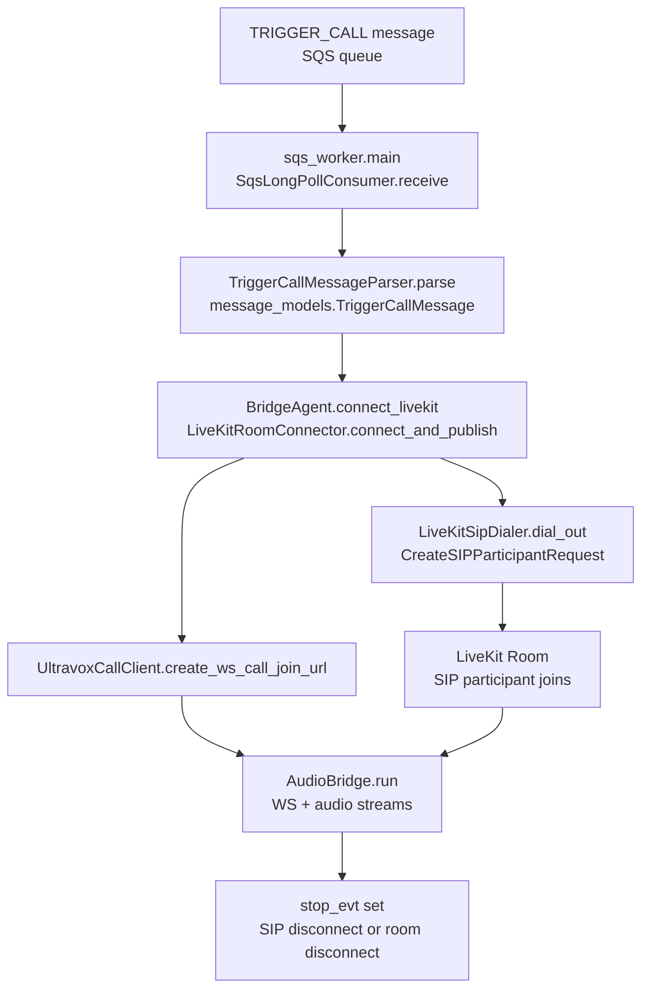

# Project Overview

This project (`outbound-call-gateway`) is a **LiveKit SIP \<-\> Ultravox Realtime audio bridge** with an optional **SQS-driven outbound dialer**.

- The core bridge connects a SIP leg in LiveKit to an Ultravox Realtime serverWebSocket call, streaming raw audio in both directions and reacting to LiveKit room events (`lk_ultravox_bridge/agent.py`, `lk_ultravox_bridge/audio_bridge.py`, `lk_ultravox_bridge/livekit_client.py`, `lk_ultravox_bridge/ultravox_client.py`).
- The CLI entrypoint handles **outbound** and **inbound** bridge modes and can also delegate to the SQS worker when invoked in outbound mode without a destination number (`lk_ultravox_bridge/__main__.py`, `lk_ultravox_bridge/compat.py`, `bridge.py`).
- The SQS worker consumes `TRIGGER_CALL` messages from an AWS SQS queue, parses them into a strongly-typed model, and for each valid message starts a full outbound call flow (LiveKit SIP dial-out + Ultravox call + audio bridge) (`lk_ultravox_bridge/sqs_worker.py`, `lk_ultravox_bridge/message_models.py`, `lk_ultravox_bridge/sqs_consumer.py`).

No testes automatizados foram encontrados no código (conforme contexto fornecido).


# How to Run

## Install

- Python: **>= 3.10** (`pyproject.toml`).
- Install dependencies (as documented):

```bash
python -m venv .venv
source .venv/bin/activate
pip install -r requirements.txt
```

Dependências principais: `httpx`, `websockets`, `boto3`, `livekit`, `livekit-api`, `python-dotenv` (`requirements.txt`).

## Required configuration (environment)

Todas as configurações vêm de variáveis de ambiente. O módulo `config.py` chama `load_dotenv(override=True)` antes de ler `os.environ`, fazendo com que valores em `.env` na raiz do projeto sobrescrevam o ambiente do shell.

### Roteamento por país — `CountryProfile`

A configuração LiveKit + SIP é **por país**, indexada por prefixo do número de destino:

| Prefixo | Código | Provider | Variáveis de env |
|---------|--------|----------|-----------------|
| `+55`   | `BR`   | Twilio   | `LIVEKIT_URL_BR`, `LIVEKIT_WSS_URL_BR`, `LIVEKIT_API_KEY_BR`, `LIVEKIT_API_SECRET_BR`, `SIP_TRUNK_ID_BR`, `SIP_FROM_NUMBER_BR` |
| `+56`   | `CL`   | Switch   | `LIVEKIT_URL_CL`, `LIVEKIT_WSS_URL_CL`, `LIVEKIT_API_KEY_CL`, `LIVEKIT_API_SECRET_CL`, `SIP_TRUNK_ID_CL`, `SIP_FROM_NUMBER_CL` |

O mapa de profiles é construído em `config.py` no momento do import (`_PROFILE_MAP`). `BridgeConfig.resolve_profile(to_number)` seleciona o profile correto com base no prefixo e chama `profile.validate()` antes de retornar. Número com prefixo desconhecido levanta `ValueError`.

### Variáveis compartilhadas (em `BridgeConfig`)

- Ultravox: `ULTRAVOX_API_KEY`, `ULTRAVOX_CALLS_URL`, `ULTRAVOX_VOICE`, `ULTRAVOX_SYSTEM_PROMPT`
- Áudio: `SAMPLE_RATE` (int, default `48000`), `CHANNELS` (int, default `1`), `FRAME_MS` (int, default `20`)
- AWS / SQS: `AWS_REGION`, `AWS_PROFILE`, `AWS_ACCESS_KEY_ID`, `AWS_SECRET_ACCESS_KEY`, `AWS_ACCOUNT_ID`, `SQS_QUEUE_NAME`

### Validações explícitas via `require` / `validate`

- CLI / compat (`lk_ultravox_bridge/compat.py`): `ULTRAVOX_API_KEY`, `ULTRAVOX_VOICE`.
- SQS worker (`lk_ultravox_bridge/sqs_worker.py`): `ULTRAVOX_API_KEY`, `ULTRAVOX_VOICE`.
- SIP dial-out (`lk_ultravox_bridge/livekit_client.py`, `LiveKitSipDialer.dial_out`): todos os 6 campos do `CountryProfile` via `profile.validate()`.
- Ultravox REST (`lk_ultravox_bridge/ultravox_client.py`): `ULTRAVOX_API_KEY`, `ULTRAVOX_VOICE`.

## CLI bridge (sem SQS)

Entrypoint principal:

- `python -m lk_ultravox_bridge` &rarr; `lk_ultravox_bridge/__main__.py` &rarr; `lk_ultravox_bridge.compat.main()`.
- `python bridge.py` (script raiz) também chama `lk_ultravox_bridge.compat.main()` com a mesma semântica.

Uso (conforme `README.md` + `lk_ultravox_bridge/compat.py`):

```bash
# Outbound: disca imediatamente para um número E.164
python -m lk_ultravox_bridge --mode outbound --to +5511999999999

# Inbound: espera chamadas SIP entrarem na sala especificada
python -m lk_ultravox_bridge --mode inbound --room asterisk-inbound-test
```

Semântica (`lk_ultravox_bridge/compat.py`):

- `--mode outbound --to <E.164>`:
  - Gera `room_name` se não for passado (`test-call-<hex>`).
  - Conecta ao LiveKit (RTC) e publica um track de áudio local (`BridgeAgent.connect_livekit`).
  - Cria uma chamada Ultravox via REST, recebendo um `joinUrl` WebSocket (`UltravoxCallClient.create_ws_call_join_url`).
  - Cria um participante SIP no LiveKit apontando para `room_name` (`LiveKitSipDialer.dial_out`).
  - Inicia o bridge de áudio entre o SIP/LiveKit e Ultravox (`BridgeAgent.run_bridge` + `AudioBridge.run`).
- `--mode inbound`:
  - Usa `room_name` fixo (`asterisk-inbound-test`) se não for informado.
  - Não faz dial-out; apenas espera participantes SIP entrarem na sala.
  - Quando o áudio remoto estiver disponível, inicia o mesmo fluxo de bridge.

## SQS-driven outbound

O SQS worker pode ser iniciado de duas formas:

```bash
# Caminho explícito (README.md)
export AWS_REGION=us-east-1
export AWS_PROFILE=riachuelo-stage
export AWS_ACCOUNT_ID=481955878483
export SQS_QUEUE_NAME=TriggerCallQueue

python -m lk_ultravox_bridge.sqs_worker

# Caminho via compat CLI (lk_ultravox_bridge/compat.py)
python -m lk_ultravox_bridge --mode outbound
# (outbound sem --to delega para .sqs_worker.main)
```

Semântica (`lk_ultravox_bridge/sqs_worker.py`, `lk_ultravox_bridge/sqs_consumer.py`):

- Resolve o `queue_url` como:
  - `https://sqs.{AWS_REGION}.amazonaws.com/{AWS_ACCOUNT_ID}/{SQS_QUEUE_NAME}`.
- Cria um cliente SQS (`boto3.Session.client("sqs")`):
  - Se `AWS_ACCESS_KEY_ID`/`AWS_SECRET_ACCESS_KEY` forem definidos e diferentes de `"none"`, usa chaves estáticas.
  - Caso contrário, usa `AWS_PROFILE` e `AWS_REGION`.
- Loop principal:
  - Long-poll SQS com `MaxNumberOfMessages=1`, `WaitTimeSeconds=20`, `VisibilityTimeout=300` segundos.
  - Para cada mensagem:
    - Chama `TriggerCallProcessor.process_body(m.body)` (parsing + call flow).
    - Se não houver exceção, deleta a mensagem (`delete_message`).
    - Se ocorrer exceção, loga com `log.exception` e **não** deleta; a mensagem volta após o `VisibilityTimeout`.


# Runtime Flow (Happy Path)

## Happy path: SQS TRIGGER_CALL outbound

1. **Mensagem TRIGGER_CALL chega na fila SQS** configurada (`SqsQueueResolver.resolve_queue_url`).
2. O worker (`sqs_worker.main`) faz long-poll SQS via `SqsLongPollConsumer.receive`, obtendo uma `SqsMessage` com `body` em JSON.
3. `TriggerCallProcessor.process_body`:
   - Faz `json.loads(body)`.
   - Usa `TriggerCallMessageParser.parse` para validar `messageType=="TRIGGER_CALL"` e construir um `TriggerCallMessage` com `metadata`.
   - Calcula `to_number` chamando `TriggerCallMessage.primary_phone_number()` (escolhe o número de menor `order` e prefixa com `"+"`).
   - Extrai `system_prompt` de `metadata.prompt_text`.
   - Chama `cfg.resolve_profile(to_number)` para selecionar o `CountryProfile` correto (BR para `+55`, CL para `+56`).
   - Gera `room_name` do tipo `"call-<hex>"` e loga o contexto (id, tenant, org, destino, country).
4. Inicializa um `BridgeAgent(cfg, log, room_name, profile)` e chama `BridgeAgent.connect_livekit`:
   - Gera um token JWT para o LiveKit (`LiveKitTokenFactory.generate_token`).
   - Conecta ao LiveKit RTC via WebSocket (`LiveKitRoomConnector.connect_and_publish`).
   - Publica um track de áudio local com o `AudioSource` configurado (`sample_rate`, `channels`).
   - Registra handlers para eventos de participante/track/disconnect.
5. Chama `UltravoxCallClient.create_ws_call_join_url(system_prompt=system_prompt)`:
   - Faz `POST` para `ULTRAVOX_CALLS_URL` com `X-API-Key` e payload contendo `systemPrompt`, `voice`, e parâmetros de áudio (`inputSampleRate`, `outputSampleRate`, `clientBufferSizeMs`).
   - Valida `resp.status_code < 300`, caso contrário loga o body de erro e levanta exceção.
   - Lê `joinUrl` e `callId` do JSON de resposta.
6. Cria um dial-out SIP para o número de destino via `LiveKitSipDialer.dial_out`:
   - Usa `api.LiveKitAPI` com `LIVEKIT_URL`, `LIVEKIT_API_KEY`, `LIVEKIT_API_SECRET`.
   - Constrói `CreateSIPParticipantRequest` com `sip_trunk_id`, `sip_call_to`, `sip_number`, `room_name` e configura `wait_until_answered=True`, `krisp_enabled=True`.
   - Aguarda a criação do participante SIP e loga IDs/tempos.
7. Quando o participante SIP se conecta e publica um track de áudio remoto, o handler `track_subscribed` em `BridgeAgent.connect_livekit`:
   - Detecta o `RemoteAudioTrack` SIP,
   - Armazena em `self.remote_audio_track`,
   - Seta o evento `_remote_track_ready`.
8. `BridgeAgent.run_bridge(join_url)`:
   - Aguarda `_remote_track_ready`.
   - Cria um `AudioBridge` e chama `AudioBridge.run(join_url, remote_audio_track, audio_source, stop_evt)`.
9. `AudioBridge.run`:
   - Abre um WebSocket para `join_url` (Ultravox) com `ping_interval=20`, `ping_timeout=20`, `close_timeout=5`.
   - Inicia três tarefas concorrentes:
     - `_livekit_to_ultravox`: lê frames de áudio da SIP leg (LiveKit) e envia bytes para o WS Ultravox.
     - `_ultravox_to_livekit`: lê bytes do WS Ultravox, remonta frames e injeta no `AudioSource` do LiveKit.
     - `stop_evt.wait()`: aguarda sinal de parada.
   - Quando qualquer uma das três completa, cancela as outras; se `_livekit_to_ultravox` ou `_ultravox_to_livekit` terminarem com exceção, a exceção é reerguida.
10. Condições de término:
    - Se o participante SIP desconectar, o handler `participant_disconnected` em `BridgeAgent.connect_livekit` detecta identidades prefixadas com `"sip-"` e seta `stop_evt`.
    - Se a sala LiveKit desconectar, o handler `disconnected` também seta `stop_evt`.
    - `_livekit_to_ultravox` e `_ultravox_to_livekit` chamam `stop_evt.set()` em seus `finally`, garantindo que o bridge pare em caso de erro.
11. Após `AudioBridge.run` retornar, `BridgeAgent.run_bridge` finaliza e `TriggerCallProcessor.process_body` retorna sem erro.
12. O loop do worker então chama `SqsLongPollConsumer.delete(receipt_handle)` para **ack/deletar** a mensagem SQS.

## Happy path: CLI outbound/inbound direto (sem SQS)

Fluxo é similar, mas sem parsing SQS:

- `lk_ultravox_bridge/compat.py`:
  - Carrega `BridgeConfig`.
  - Garante variáveis críticas com `require_env`.
  - Faz `dump_effective_config()` via `ConfigDumper`.
  - Em modo `outbound` com `--to`:
    - Gera `room_name`, cria `BridgeAgent`, conecta ao LiveKit, chama `create_ultravox_ws_call()`, dispara `dial_out_livekit` em background e chama `agent.run_bridge`.
  - Em modo `inbound`:
    - Usa `room_name` fixo ou informado e não chama `dial_out_livekit` (espera chamadas SIP entrarem).
- Toda a lógica de áudio e encerramento é a mesma descrita acima.





# Key Modules

| Module | Responsibility | Key Entry Functions/Classes | Notes |
| ------ | -------------- | --------------------------- | ----- |
| `lk_ultravox_bridge/__main__.py` | Entrypoint de módulo (`python -m lk_ultravox_bridge`) | `asyncio.run(main())` chamando `compat.main` | Usa `lk_ultravox_bridge.compat.main` como implementação real. |
| `bridge.py` | Script raiz para rodar o bridge via CLI | `if __name__ == "__main__": asyncio.run(main())` | Também delega para `lk_ultravox_bridge.compat.main`, mantendo compatibilidade com o CLI original documentado no README. |
| `lk_ultravox_bridge/compat.py` | CLI principal (outbound/inbound + delegação para SQS worker) | `main()`, `async main()`, `BridgeAgent` wrapper, funções utilitárias (`require_env`, `dump_effective_config`, `create_ultravox_ws_call`, `dial_out_livekit`) | Usa `BridgeConfig` global e logger para orquestrar modos outbound/inbound e, em outbound sem `--to`, iniciar `sqs_worker.main`. |
| `lk_ultravox_bridge/agent.py` | Orquestração da ponte LiveKit \<-\> Ultravox | `BridgeAgent` (`connect_livekit`, `run_bridge`) | Conecta ao LiveKit RTC, registra handlers de eventos, aguarda track de áudio remoto e dispara `AudioBridge.run` com `stop_evt`. |
| `lk_ultravox_bridge/audio_bridge.py` | Bridge de áudio bidirecional entre LiveKit e Ultravox WS | `AudioBridge.run`, `_livekit_to_ultravox`, `_ultravox_to_livekit` | Controla WebSocket Ultravox, streaming de bytes de áudio, montagem de frames e métricas de throughput; para ao receber `stop_evt` ou erro. |
| `lk_ultravox_bridge/livekit_client.py` | Integração com LiveKit (API + RTC) | `LiveKitTokenFactory`, `LiveKitSipDialer.dial_out`, `LiveKitRoomConnector.connect_and_publish`, `LiveKitSession` | Gera tokens JWT, cria participantes SIP via API, conecta ao LiveKit RTC, publica track local com `AudioSource`. |
| `lk_ultravox_bridge/ultravox_client.py` | Integração com Ultravox Realtime (REST) | `UltravoxCallClient.create_ws_call_join_url` | Cria chamadas Ultravox via REST (`httpx.AsyncClient`), valida status, extrai `joinUrl` e `callId`. |
| `lk_ultravox_bridge/sqs_worker.py` | Worker SQS que consome mensagens `TRIGGER_CALL` e inicia chamadas | `TriggerCallProcessor`, `async main()` | Cria cliente SQS, resolve `queue_url`, faz long-poll e para cada mensagem válida inicia um fluxo completo de chamada (LiveKit + Ultravox + bridge). |
| `lk_ultravox_bridge/sqs_consumer.py` | Abstrações de cliente/consumidor SQS | `SqsClientFactory.build`, `SqsQueueResolver.resolve_queue_url`, `SqsLongPollConsumer.receive/delete` | Gerencia construção de cliente SQS (profile vs chaves estáticas), montagem de URL de fila e long-poll com `VisibilityTimeout` configurável. |
| `lk_ultravox_bridge/message_models.py` | Modelo e parser da mensagem `TRIGGER_CALL` | `TriggerCallMessage`, `TriggerCallMetadata`, `PhoneNumber`, `TriggerCallMessageParser.parse` | Define o contrato esperado da mensagem, valida `messageType=="TRIGGER_CALL"` e `metadata.subject.prompt.text`, constrói o número primário e campos de metadados. |
| `lk_ultravox_bridge/config.py` | Configuração de runtime via env vars | `BridgeConfig`, `CountryProfile`, `BridgeConfig.resolve_profile` | `CountryProfile` agrupa os 6 campos LiveKit+SIP por país (`_BR` para +55, `_CL` para +56). `BridgeConfig` contém config compartilhada (Ultravox, AWS, áudio) e `resolve_profile(to_number)` seleciona o profile correto pelo prefixo. |
| `lk_ultravox_bridge/logging_utils.py` | Dump de configuração para logs | `ConfigDumper.dump_effective_config` | Loga ambos os `CountryProfile` (BR e CL) e config compartilhada; aplica mascaramento parcial para chaves de API sensíveis. |
| `lk_ultravox_bridge/cli.py` | CLI alternativo/antigo | `main_async`, `main` | Implementa interface semelhante à de `compat.py`, mas não é referenciado por `__main__` nem por `bridge.py`; uso atual em produção **não confirmado no código**. |
| `lk_ultravox_bridge/__init__.py` | Não avaliado aqui | Não usado diretamente no fluxo descrito | Não confirmado no código. |


# Failure Modes & Handling

## SQS e parsing de mensagem

- **Mensagem com `messageType` inválido**:
  - `TriggerCallMessageParser.parse` valida `payload["messageType"] == "TRIGGER_CALL"` e levanta `ValueError` caso contrário.
  - Em `sqs_worker.main`, isso faz `TriggerCallProcessor.process_body` falhar; a exceção é capturada no loop principal e logada com `log.exception`.
  - A mensagem **não** é deletada (`delete_message` só é chamado se `process_body` não lançar), então retornará à fila após o `VisibilityTimeout` configurado (300s no worker).
- **Falta de `metadata.subject.prompt.text`**:
  - `TriggerCallMessageParser.parse` exige `metadata.subject.prompt.text` (levanta `ValueError` se vazio).
  - Efeito é o mesmo do caso anterior: log de erro, sem deleção da mensagem; retry automático pela SQS.
- **Lista de números vazia**:
  - `TriggerCallMessage.primary_phone_number` lança `ValueError` se `metadata.phoneNumbers` estiver vazia.
  - Novamente, erro sobe até o loop do worker, que loga e não deleta a mensagem.
- **DLQ / redrive policy**:
  - Não há referência explícita a DLQ ou redrive policy no código; qualquer configuração de DLQ ocorre, se existir, apenas na infraestrutura SQS. **Não confirmado no código.**

## LiveKit / SIP

- **Falha no CreateSIPParticipant**:
  - `LiveKitSipDialer.dial_out` chama `lk.sip.create_sip_participant(req)` e não envolve isso em `try/except` local; qualquer exceção sobe.
  - Na CLI (`compat.main`), `dial_out_livekit` roda em uma task de background; exceções são capturadas e logadas com `log.exception("[Main] dial task failed: %r", e)`, sem parar explicitamente o bridge.
  - No SQS worker, `dial_out` também é executado em task; exceções são logadas em `TriggerCallProcessor.process_body` e **não** interrompem explicitamente o loop principal, mas podem fazer a task de dial-out falhar enquanto o bridge segue.
- **Desconexão do participante SIP ou da sala**:
  - Handlers em `BridgeAgent.connect_livekit`:
    - `participant_disconnected`: se `identity` começa com `"sip-"`, loga e chama `self._stop.set()`.
    - `disconnected`: loga e chama `self._stop.set()`.
  - `AudioBridge.run` escuta `stop_evt`; ao ser setado, cancela as tarefas de streaming e encerra o bridge.

## Ultravox REST / WebSocket

- **Erro HTTP ao criar chamada Ultravox**:
  - `UltravoxCallClient.create_ws_call_join_url`:
    - Loga `status_code` e tempo.
    - Se `status_code >= 300`, loga `errorBody` e chama `resp.raise_for_status()`.
  - CLI (`compat.main`):
    - Não captura essa exceção; erro aborta o comando (processo termina com stacktrace).
  - SQS worker:
    - Exceção sobe para `TriggerCallProcessor.process_body` e é capturada no loop principal do worker; loga via `log.exception` e a mensagem volta após o `VisibilityTimeout`.
- **Falta de `joinUrl` no JSON**:
  - Após `resp.json()`, se `joinUrl` estiver ausente, levanta `RuntimeError("Ultravox call created but joinUrl is missing...")`.
  - Tratamento é igual ao caso anterior (erro fatal na CLI; retry automático via SQS no worker).
- **Erro no WebSocket Ultravox durante streaming**:
  - Exceções em `_livekit_to_ultravox` ou `_ultravox_to_livekit`:
    - São propagadas; `AudioBridge.run` verifica `task.exception()` e reergue se necessário.
    - `finally` de ambas as corrotinas chama `stop_evt.set()`, garantindo parada do bridge.
  - Não há lógica de reconexão automática. **Não confirmado no código.**

## SQS worker loop

- **Exceções não tratadas em `process_body`**:
  - O loop em `sqs_worker.main` encapsula `processor.process_body` em `try/except Exception as e`.
  - Em caso de exceção:
    - Loga `[SQS] processing failed (message will return after visibility timeout)` com stacktrace.
    - Não chama `delete`, permitindo que SQS reentregue a mensagem após o timeout.
  - Não há contagem explícita de retries nem lógica de backoff além do comportamento padrão de SQS. **Não confirmado no código.**

## Config / segurança

- **Carregamento de configuração via `.env`**:
  - `lk_ultravox_bridge/config.py` chama `load_dotenv(override=True)` antes de definir `BridgeConfig`, fazendo com que variáveis definidas em `.env` sobrescrevam quaisquer valores já presentes no ambiente para as chaves usadas (`LIVEKIT_*`, `ULTRAVOX_*`, `SIP_*`, `AWS_*`, etc.).
- **Exposição de credenciais em logs**:
  - `ConfigDumper.dump_effective_config` agora mascara `LIVEKIT_API_KEY`, `LIVEKIT_API_SECRET` e `ULTRAVOX_API_KEY`, exibindo apenas os 4 primeiros caracteres (`lk_ultravox_bridge/logging_utils.py`).
  - Outros campos logados são não sensíveis (URLs, IDs, região, queue); credenciais AWS não são logadas diretamente nesse método.
- **Uso de defaults sensíveis**:
  - `BridgeConfig` ainda possui valores default não vazios para chaves de API e credenciais AWS (`lk_ultravox_bridge/config.py`).
  - Se um `.env` adequado não for definido, esses valores serão usados em runtime.


# Operational Notes

## Entry points efetivos

- **CLI principal**:
  - `python -m lk_ultravox_bridge` &rarr; `lk_ultravox_bridge/__main__.py` &rarr; `asyncio.run(main())`, que chama `lk_ultravox_bridge.compat.main`.
  - `python bridge.py` faz o mesmo (`bridge.py` importa `lk_ultravox_bridge.compat.main` e o executa em `asyncio.run`).
- **SQS worker dedicado**:
  - `python -m lk_ultravox_bridge.sqs_worker` executa `lk_ultravox_bridge/sqs_worker.py` diretamente.
- **CLI alternativo (`lk_ultravox_bridge/cli.py`)**:
  - Implementa outro CLI, mas não é referenciado pelos entrypoints acima. Uso em produção **não confirmado no código**.

## Contrato da mensagem SQS TRIGGER_CALL

Baseado em `lk_ultravox_bridge/message_models.py`:

- Top-level JSON esperado:
  - `id`: string (opcional, mas sempre convertido para `str`).
  - `messageType`: deve ser `"TRIGGER_CALL"` (caso contrário, erro).
  - `source`: string.
  - `organizationId`: string.
  - `tenantId`: string.
  - `createdAt`: string (timestamp como string, sem validação de formato).
  - `metadata`: objeto com:
    - `workflowId`, `campaignId`, `customerId`, `userId`, `telephonyProvider`: strings (convertidos via `str(...) or ""`).
    - `externalCustomerId`: opcional (`None` se ausente).
    - `fullName`: opcional (`None` se ausente).
    - `direction`: string (`str(...) or ""`).
    - `phoneNumbers`: lista de objetos `{ "number": ..., "order": ... }`:
      - Para cada item, se `number` existir, é convertido em `PhoneNumber(number=str(n), order=int(o or 0))`.
      - `primary_phone_number()`:
        - Ordena a lista por `order` ascendente.
        - Se a lista estiver vazia, levanta `ValueError("metadata.phoneNumbers is empty")`.
        - Retorna `"+" + nums[0].number` (prefixo `"+"` é sempre adicionado).
    - `subject`: objeto (pode ser omitido, tratado como `{}`):
      - `prompt`: objeto (pode ser omitido, tratado como `{}`).
      - `prompt.text`: **obrigatório**; se ausente ou vazio, `TriggerCallMessageParser` levanta `ValueError("metadata.subject.prompt.text is required")`.
      - `prompt.greetingMessage`: opcional; mapeado para `TriggerCallMetadata.greeting_message` mas não é usado em outro lugar do código. Uso futuro **não confirmado no código**.

## Áudio e parâmetros de streaming

- LiveKit:
  - `LiveKitRoomConnector.connect_and_publish` cria:
    - `rtc.AudioSource(sample_rate=SAMPLE_RATE, num_channels=CHANNELS)`.
    - `LocalAudioTrack` com nome `"ultravox-agent-audio"` publicado para o participante local.
- Roteamento de áudio:
  - SIP / LiveKit &rarr; Ultravox:
    - `_livekit_to_ultravox` usa `rtc.AudioStream.from_track` com `frame_size_ms=FRAME_MS`.
    - Cada frame de `event.frame.data` é enviado como payload binário bruto no WebSocket Ultravox.
  - Ultravox &rarr; LiveKit:
    - `_ultravox_to_livekit` calcula `samples_per_frame = SAMPLE_RATE * (FRAME_MS / 1000)`, `bytes_per_frame = samples_per_frame * 2 * CHANNELS`.
    - Acumula bytes em um buffer e, sempre que houver `bytes_per_frame`, cria um `rtc.AudioFrame` e o injeta via `audio_source.capture_frame`.
- Mensagens de controle:
  - Se Ultravox enviar texto JSON com `{"type": "playbackClearBuffer"}`, o código:
    - Chama `audio_source.clear_queue()`.
    - Limpa o buffer local.
  - Outras mensagens JSON são apenas logadas (`[Ultravox][WS][data]`).

## Timeouts e parâmetros operacionais

- SQS:
  - `SqsLongPollConsumer.receive` é chamado no worker com:
    - `max_messages=1`, `wait_seconds=20`, `visibility_timeout=300`.
  - Sem lógica de backoff explícito além do tempo de espera de 20s.
- Ultravox REST:
  - `httpx.AsyncClient(timeout=30.0)` é usado para `POST` em `ULTRAVOX_CALLS_URL`.
- Ultravox WebSocket:
  - `websockets.connect(join_url, max_size=None, ping_interval=20, ping_timeout=20, close_timeout=5)`.
  - `max_size=None` permite mensagens sem limite de tamanho imposto pelo cliente.
- LiveKit:
  - Timeouts de conexão/RTC são os defaults da biblioteca `livekit.rtc`. Valores específicos não aparecem no código. **Não confirmado no código.**


# TODO (Next 5 Steps)

| # | Item | Rationale | Priority |
| - | ---- | --------- | -------- |
| 1 | Adicionar testes unitários para `TriggerCallMessageParser`, `TriggerCallProcessor` e `BridgeConfig.resolve_profile` | Parsing, roteamento por país e orquestração de chamadas não têm cobertura automatizada; bugs podem causar retries infinitos na fila ou chamar o trunk errado. | Alta |
| 2 | Adicionar suporte a novos países sem mudança de código | Hoje adicionar um país requer editar `_PROFILE_MAP` em `config.py`; externalizando a tabela de rotas (ex.: JSON no env ou SSM) seria possível sem redeploy. | Alta |
| 3 | Implementar política explícita de retry / DLQ para erros permanentes de processamento SQS | Hoje o worker depende apenas do `VisibilityTimeout`; mensagens inválidas podem ser reprocessadas indefinidamente; separar erros de parsing (permanentes) de erros de rede (transitórios) evitaria loops. | Média |
| 4 | Remover defaults sensíveis hardcoded de `BridgeConfig` e `CountryProfile` | Defaults com valores reais de API keys aumentam risco de uso acidental em ambientes errados; melhor falhar explicitamente com `require`. | Média |
| 5 | Adicionar observabilidade (métricas) por país para duração de chamadas, taxa de erros e throughput de áudio | O código já loga bastante coisa, mas não há métricas estruturadas; instrumentar por `country_code` facilitaria diagnóstico de problemas específicos de um provider. | Média |

