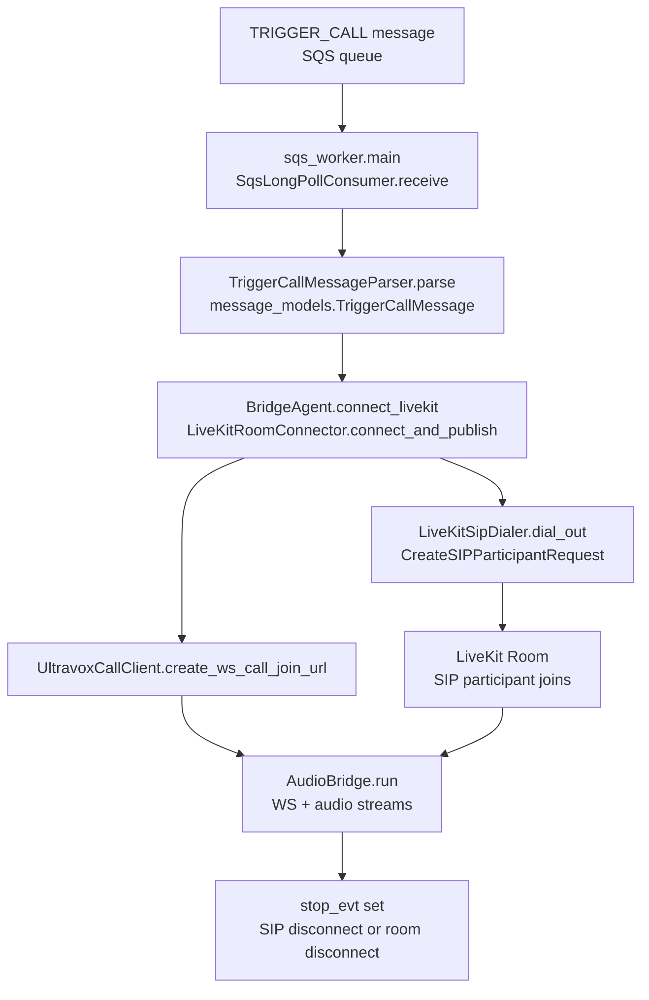

# Project Overview

This project (`outbound-call-gateway`) is a **LiveKit SIP \<-\> Ultravox Realtime audio bridge** with an optional **SQS-driven outbound dialer**.

- The core bridge connects a SIP leg in LiveKit to an Ultravox Realtime serverWebSocket call, streaming raw audio in both directions and reacting to LiveKit room events (`lk_ultravox_bridge/agent.py`, `lk_ultravox_bridge/audio_bridge.py`, `lk_ultravox_bridge/livekit_client.py`, `lk_ultravox_bridge/ultravox_client.py`).
- The CLI entrypoint handles **outbound** and **inbound** bridge modes and can also delegate to the SQS worker when invoked in outbound mode without a destination number (`lk_ultravox_bridge/__main__.py`, `lk_ultravox_bridge/compat.py`, `bridge.py`).
- The SQS worker consumes `TRIGGER_CALL` messages from an AWS SQS queue, parses them into a strongly-typed model, and for each valid message starts a full outbound call flow (LiveKit SIP dial-out + Ultravox call + audio bridge) (`lk_ultravox_bridge/sqs_worker.py`, `lk_ultravox_bridge/message_models.py`, `lk_ultravox_bridge/sqs_consumer.py`).

Testes unitários em `tests/unit/` (pytest + pytest-asyncio + respx; instalar com `pip install -r requirements-dev.txt`, rodar com `pytest`). Cobrem: contrato da mensagem TRIGGER_CALL, roteamento por país, montagem de frames/jitter buffer/barge-in/watchdog do `AudioBridge`, contrato REST Ultravox (via respx, sem rede), handlers de eventos do `BridgeAgent`, orquestração do `TriggerCallProcessor` (semântica de erro que controla o delete/retry na fila) e mascaramento de segredos em logs. A suite não depende de `.env` nem de rede — a regra de isolamento está documentada em `tests/conftest.py`.


# How to Run

## Install

- Python: **>= 3.10** (`pyproject.toml`).
- Install dependencies (as documented):

```bash
python -m venv .venv
source .venv/bin/activate
pip install -r requirements.txt
```

Dependências principais: `httpx`, `websockets`, `boto3`, `livekit`, `livekit-api`, `python-dotenv` (`requirements.txt`).

## Required configuration (environment)

Todas as configurações vêm de variáveis de ambiente. O módulo `config.py` chama `load_dotenv(override=True)` antes de ler `os.environ`, fazendo com que valores em `.env` na raiz do projeto sobrescrevam o ambiente do shell.

### Roteamento por país — `CountryProfile`

A configuração LiveKit + SIP é **por país**, indexada por prefixo do número de destino:

| Prefixo | Código | Provider | Variáveis de env |
|---------|--------|----------|-----------------|
| `+55`   | `BR`   | Twilio   | `LIVEKIT_URL_BR`, `LIVEKIT_WSS_URL_BR`, `LIVEKIT_API_KEY_BR`, `LIVEKIT_API_SECRET_BR`, `SIP_TRUNK_ID_BR`, `SIP_FROM_NUMBER_BR`, `ULTRAVOX_VOICE_BR` |
| `+56`   | `CL`   | Switch   | `LIVEKIT_URL_CL`, `LIVEKIT_WSS_URL_CL`, `LIVEKIT_API_KEY_CL`, `LIVEKIT_API_SECRET_CL`, `SIP_TRUNK_ID_CL`, `SIP_FROM_NUMBER_CL`, `ULTRAVOX_VOICE_CL` |

Cada `CountryProfile` tem **7 campos configuráveis**: os 6 de LiveKit/SIP mais `ultravox_voice`. A voz por país (`ULTRAVOX_VOICE_{CC}`) tem prioridade; se ausente, cai no `ULTRAVOX_VOICE` global.

O mapa de profiles é construído em `config.py` no momento do import (`_PROFILE_MAP`). `BridgeConfig.resolve_profile(to_number)` seleciona o profile e chama `profile.validate()` antes de retornar (campo faltante levanta `SystemExit`). **Roteamento**: `+56` → CL; **qualquer outro prefixo (incluindo `+55`) → BR como fallback** — número com prefixo desconhecido NÃO levanta erro, é roteado pelo profile BR/Twilio.

### Variáveis compartilhadas (em `BridgeConfig`)

- Ultravox: `ULTRAVOX_API_KEY`, `ULTRAVOX_CALLS_URL`, `ULTRAVOX_VOICE` (fallback global de voz), `ULTRAVOX_SYSTEM_PROMPT`, `ULTRAVOX_TEMPERATURE` (default `0.3`), `ULTRAVOX_MODEL` (vazio = default da API), `ULTRAVOX_JOIN_TIMEOUT` (default `60s` — conta a partir da criação da call, não do atendimento SIP), `ULTRAVOX_GREETING_DELAY` (default `4s`), `ULTRAVOX_VOICEMAIL_HANGUP` (default ligado — ver abaixo)
- Áudio: `SAMPLE_RATE` (int, default `48000` no código — **em produção use `16000`**: 48kHz causa artefatos de resampling na perna SIP), `CHANNELS` (int, default `1`), `FRAME_MS` (int, default `20`)
- Jitter buffer: `MAX_BUFFER_FRAMES` (int, default `5` = 100ms), `KEEP_BUFFER_FRAMES` (int, default `2` = 40ms) — controla o descarte de frames antigos na direção Ultravox→LiveKit para evitar delay acumulativo
- AWS / SQS: `AWS_REGION`, `AWS_PROFILE`, `AWS_ACCESS_KEY_ID`, `AWS_SECRET_ACCESS_KEY`, `AWS_ACCOUNT_ID`, `SQS_QUEUE_NAME`
- Eventos CALL_HISTORY: `CALL_HISTORY_QUEUE_NAME` (vazio = desligado, padrão opt-in igual `GRAFANA_*`) — quando setado, o worker publica eventos de lifecycle da chamada (`CALL_ATTEMPT_STARTED`/`SIP_DIAL_ANSWERED`/`SIP_BRIDGE_ACTIVE`/`SIP_CALL_ENDED`/`CALL_NOT_ANSWERED`/`SIP_CALL_FAILED`) na fila indicada, body JSON cru no contrato CALL_HISTORY. Samples versionados em `event_samples/` (com README); o teste `tests/unit/test_call_history.py` falha se código e samples divergirem. Emissão é best-effort (nunca bloqueia/derruba chamada viva) e sempre colada na mesma linha de log que o Grafana conta (`tests/unit/test_grafana_contract.py` pina esse acoplamento).

### Validações explícitas via `require` / `validate`

- CLI / compat (`lk_ultravox_bridge/compat.py`): `ULTRAVOX_API_KEY`.
- SQS worker (`lk_ultravox_bridge/sqs_worker.py`): `ULTRAVOX_API_KEY`.
- SIP dial-out (`lk_ultravox_bridge/livekit_client.py`, `LiveKitSipDialer.dial_out`): todos os 7 campos do `CountryProfile` via `profile.validate()`.
- Ultravox REST (`lk_ultravox_bridge/ultravox_client.py`): `ULTRAVOX_API_KEY` + voz resolvida (parâmetro `voice` ou `ULTRAVOX_VOICE` global; se nenhum, `SystemExit`).

## CLI bridge (sem SQS)

Entrypoint principal:

- `python -m lk_ultravox_bridge` &rarr; `lk_ultravox_bridge/__main__.py` &rarr; `lk_ultravox_bridge.compat.main()`.
- `python bridge.py` (script raiz) também chama `lk_ultravox_bridge.compat.main()` com a mesma semântica.

Uso (conforme `README.md` + `lk_ultravox_bridge/compat.py`):

```bash
# Outbound: disca imediatamente para um número E.164
python -m lk_ultravox_bridge --mode outbound --to +5511999999999

# Inbound: espera chamadas SIP entrarem na sala especificada
python -m lk_ultravox_bridge --mode inbound --room asterisk-inbound-test
```

Semântica (`lk_ultravox_bridge/compat.py`):

- `--mode outbound --to <E.164>`:
  - Gera `room_name` se não for passado (`test-call-<hex>`).
  - Conecta ao LiveKit (RTC) e publica um track de áudio local (`BridgeAgent.connect_livekit`).
  - Cria uma chamada Ultravox via REST, recebendo um `joinUrl` WebSocket (`UltravoxCallClient.create_ws_call_join_url`).
  - Cria um participante SIP no LiveKit apontando para `room_name` (`LiveKitSipDialer.dial_out`).
  - Inicia o bridge de áudio entre o SIP/LiveKit e Ultravox (`BridgeAgent.run_bridge` + `AudioBridge.run`).
- `--mode inbound`:
  - Usa `room_name` fixo (`asterisk-inbound-test`) se não for informado.
  - Não faz dial-out; apenas espera participantes SIP entrarem na sala.
  - Quando o áudio remoto estiver disponível, inicia o mesmo fluxo de bridge.

## SQS-driven outbound

O SQS worker pode ser iniciado de duas formas:

```bash
# Caminho explícito (README.md)
export AWS_REGION=us-east-1
export AWS_PROFILE=riachuelo-stage
export AWS_ACCOUNT_ID=481955878483
export SQS_QUEUE_NAME=TriggerCallQueue

python -m lk_ultravox_bridge.sqs_worker

# Caminho via compat CLI (lk_ultravox_bridge/compat.py)
python -m lk_ultravox_bridge --mode outbound
# (outbound sem --to delega para .sqs_worker.main)
```

Semântica (`lk_ultravox_bridge/sqs_worker.py`, `lk_ultravox_bridge/sqs_consumer.py`):

- Resolve o `queue_url` como:
  - `https://sqs.{AWS_REGION}.amazonaws.com/{AWS_ACCOUNT_ID}/{SQS_QUEUE_NAME}`.
- Cria um cliente SQS (`boto3.Session.client("sqs")`):
  - Se `AWS_ACCESS_KEY_ID`/`AWS_SECRET_ACCESS_KEY` forem definidos e diferentes de `"none"`, usa chaves estáticas.
  - Caso contrário, usa `AWS_PROFILE` e `AWS_REGION`.
- Loop principal:
  - Long-poll SQS com `MaxNumberOfMessages=1`, `WaitTimeSeconds=20`, `VisibilityTimeout=300` segundos.
  - Para cada mensagem:
    - Chama `TriggerCallProcessor.process_body(m.body)` (parsing + call flow).
    - Se não houver exceção, deleta a mensagem (`delete_message`).
    - Se ocorrer exceção, loga com `log.exception` e **não** deleta; a mensagem volta após o `VisibilityTimeout`.


# Runtime Flow (Happy Path)

## Happy path: SQS TRIGGER_CALL outbound

1. **Mensagem TRIGGER_CALL chega na fila SQS** configurada (`SqsQueueResolver.resolve_queue_url`).
2. O worker (`sqs_worker.main`) faz long-poll SQS via `SqsLongPollConsumer.receive`, obtendo uma `SqsMessage` com `body` em JSON.
3. `TriggerCallProcessor.process_body`:
   - Faz `json.loads(body)`.
   - Usa `TriggerCallMessageParser.parse` para validar `messageType=="TRIGGER_CALL"` e construir um `TriggerCallMessage` com `metadata`.
   - Calcula `to_number` chamando `TriggerCallMessage.primary_phone_number()` (escolhe o número de menor `order` e prefixa com `"+"`).
   - Extrai `system_prompt` de `metadata.prompt_text`.
   - Chama `cfg.resolve_profile(to_number)` para selecionar o `CountryProfile` (CL para `+56`; BR/Twilio para qualquer outro prefixo).
   - Gera `room_name` do tipo `"call-<hex>"` e loga o contexto (id, tenant, org, destino, country).
   - Resolve a **voz**: `metadata.voiceId` da mensagem tem prioridade; senão usa `profile.ultravox_voice`.
   - Monta o dicionário de **metadata Ultravox** via `build_ultravox_metadata` (`organizationId`, `tenantId`, `workflowId`, `campaignId`, `customerId`, `callId`, `userId`, `transport="ULTRAVOX_SIP"`), enviado na criação da chamada Ultravox para rastreio.
4. Inicializa um `BridgeAgent(cfg, log, room_name, profile)` e chama `BridgeAgent.connect_livekit`:
   - Gera um token JWT para o LiveKit (`LiveKitTokenFactory.generate_token`).
   - Conecta ao LiveKit RTC via WebSocket (`LiveKitRoomConnector.connect_and_publish`).
   - Publica um track de áudio local com o `AudioSource` configurado (`sample_rate`, `channels`).
   - Registra handlers para eventos de participante/track/disconnect.
5. Chama `UltravoxCallClient.create_ws_call_join_url(system_prompt=..., voice=..., metadata=..., greeting_message=...)`:
   - Faz `POST` para `ULTRAVOX_CALLS_URL` com `X-API-Key` e payload contendo `systemPrompt`, `voice`, `temperature`, `joinTimeout`, `firstSpeakerSettings.user.fallback` (o callee fala primeiro; se ficar em silêncio por `ULTRAVOX_GREETING_DELAY`, o agente cumprimenta — com o `greetingMessage` da mensagem quando presente, senão com um prompt genérico), `recordingEnabled=True`, `metadata` (quando fornecido) e parâmetros de áudio (`inputSampleRate`, `outputSampleRate`, `clientBufferSizeMs=60`).
   - **Detecção de caixa postal** (`ULTRAVOX_VOICEMAIL_HANGUP`, ligado por default): como Twilio Elastic SIP Trunking não tem AMD, o próprio modelo é o detector — uma instrução fixa (`_VOICEMAIL_GUARD_PROMPT`) é anexada ao `systemPrompt` e a tool built-in `hangUp` é habilitada via `selectedTools`; ao reconhecer saudação de caixa postal/bipe, o agente chama `hangUp` (com `strict=true` default, a fala da gravação não cancela o desligamento) e o WS fecha, encerrando o bridge.
   - Valida `resp.status_code < 300`, caso contrário loga o body de erro e levanta exceção.
   - Lê `joinUrl` e `callId` do JSON de resposta.
6. Dispara o dial-out SIP **em background** (`asyncio.create_task`) via `LiveKitSipDialer.dial_out`:
   - Usa `api.LiveKitAPI` como async context manager (`async with`) para garantir que a `aiohttp.ClientSession` interna seja sempre fechada ao final da chamada.
   - Constrói `CreateSIPParticipantRequest` com `sip_trunk_id`, `sip_call_to`, `sip_number`, `room_name`, `participant_identity=f"sip-{to_number}"` e configura `wait_until_answered=True`, `krisp_enabled=True`.
   - A task é aguardada em bloco `finally` após `run_bridge` retornar; falha no dial é logada com `log.exception` sem mascarar o resultado do bridge.
7. Quando o participante SIP se conecta e publica um track de áudio remoto, o handler `track_subscribed` em `BridgeAgent.connect_livekit`:
   - Detecta o `RemoteAudioTrack` SIP,
   - Armazena em `self.remote_audio_track`,
   - Seta o evento `_remote_track_ready`.
8. `BridgeAgent.run_bridge(join_url)`:
   - Aguarda `_remote_track_ready`.
   - Cria um `AudioBridge` e chama `AudioBridge.run(join_url, remote_audio_track, audio_source, stop_evt)`.
9. `AudioBridge.run`:
   - Abre um WebSocket para `join_url` (Ultravox) com `ping_interval=20`, `ping_timeout=20`, `close_timeout=5`.
   - Inicia três tarefas concorrentes:
     - `_livekit_to_ultravox`: lê frames de áudio da SIP leg (LiveKit) e envia bytes para o WS Ultravox.
     - `_ultravox_to_livekit`: lê bytes do WS Ultravox, remonta frames e injeta no `AudioSource` do LiveKit. Também inicia um **watchdog de silêncio** (`_uv_silence_watchdog`): se o Ultravox ficar ≥30s sem enviar nenhuma mensagem no WS (checagem a cada 5s), o watchdog seta `stop_evt` e encerra a chamada em vez de deixar o usuário ouvindo silêncio.
     - `stop_evt.wait()`: aguarda sinal de parada.
   - Quando qualquer uma das três completa, cancela as outras; se `_livekit_to_ultravox` ou `_ultravox_to_livekit` terminarem com exceção, a exceção é reerguida.
10. Condições de término:
    - Se o participante SIP desconectar, o handler `participant_disconnected` em `BridgeAgent.connect_livekit` detecta identidades prefixadas com `"sip-"` e seta `stop_evt`.
    - Se a sala LiveKit desconectar, o handler `disconnected` também seta `stop_evt`.
    - Se o Ultravox ficar mudo por ≥30s, o watchdog de silêncio seta `stop_evt`.
    - `_livekit_to_ultravox` e `_ultravox_to_livekit` chamam `stop_evt.set()` em seus `finally`, garantindo que o bridge pare em caso de erro.
11. Após `AudioBridge.run` retornar, `BridgeAgent.run_bridge` executa um bloco `finally` que chama `room.disconnect()` **e** deleta a sala via API (`LiveKitRoomTerminator.terminate` → `DeleteRoom`). O disconnect só desanexa o cliente RTC local; é o `DeleteRoom` que remove o participante SIP e envia BYE ao trunk — sem ele, quando é o nosso lado que encerra (watchdog, `hangUp` de voicemail, erro), a perna telefônica ficaria aberta e tarifando até o outro lado desligar. A deleção é best-effort (falha vira warning, nunca mascara o resultado do bridge). Então `TriggerCallProcessor.process_body` retorna sem erro.
12. O loop do worker então chama `SqsLongPollConsumer.delete(receipt_handle)` para **ack/deletar** a mensagem SQS.

## Happy path: CLI outbound/inbound direto (sem SQS)

Fluxo é similar, mas sem parsing SQS:

- `lk_ultravox_bridge/compat.py`:
  - Carrega `BridgeConfig`.
  - Garante variáveis críticas com `require_env`.
  - Faz `dump_effective_config()` via `ConfigDumper`.
  - Em modo `outbound` com `--to`:
    - Gera `room_name`, cria `BridgeAgent`, conecta ao LiveKit, chama `create_ultravox_ws_call()`, dispara `dial_out_livekit` em background e chama `agent.run_bridge`.
  - Em modo `inbound`:
    - Usa `room_name` fixo ou informado e não chama `dial_out_livekit` (espera chamadas SIP entrarem).
- Toda a lógica de áudio e encerramento é a mesma descrita acima.



```mermaid
flowchart TD
  SQS[TRIGGER_CALL message<br/>SQS queue] --> Worker[sqs_worker.main<br/>SqsLongPollConsumer.receive]
  Worker --> Parser[TriggerCallMessageParser.parse<br/>message_models.TriggerCallMessage]
  Parser --> Agent[BridgeAgent.connect_livekit<br/>LiveKitRoomConnector.connect_and_publish]
  Agent --> Ultravox[UltravoxCallClient.create_ws_call_join_url]
  Agent --> Dialer[LiveKitSipDialer.dial_out<br/>CreateSIPParticipantRequest]
  Dialer --> LiveKitRoom[LiveKit Room<br/>SIP participant joins]
  Ultravox --> AudioBridge[AudioBridge.run<br/>WS + audio streams]
  LiveKitRoom --> AudioBridge
  AudioBridge --> End[stop_evt set<br/>SIP disconnect or room disconnect]
```


# Key Modules

| Module | Responsibility | Key Entry Functions/Classes | Notes |
| ------ | -------------- | --------------------------- | ----- |
| `lk_ultravox_bridge/__main__.py` | Entrypoint de módulo (`python -m lk_ultravox_bridge`) | `asyncio.run(main())` chamando `compat.main` | Usa `lk_ultravox_bridge.compat.main` como implementação real. |
| `bridge.py` | Script raiz para rodar o bridge via CLI | `if __name__ == "__main__": asyncio.run(main())` | Também delega para `lk_ultravox_bridge.compat.main`, mantendo compatibilidade com o CLI original documentado no README. |
| `lk_ultravox_bridge/compat.py` | CLI principal (outbound/inbound + delegação para SQS worker) | `main()`, `async main()`, `BridgeAgent` wrapper, funções utilitárias (`require_env`, `dump_effective_config`, `create_ultravox_ws_call`, `dial_out_livekit`) | Usa `BridgeConfig` global e logger para orquestrar modos outbound/inbound e, em outbound sem `--to`, iniciar `sqs_worker.main`. |
| `lk_ultravox_bridge/agent.py` | Orquestração da ponte LiveKit \<-\> Ultravox | `BridgeAgent` (`connect_livekit`, `run_bridge`) | Conecta ao LiveKit RTC, registra handlers de eventos, aguarda track de áudio remoto e dispara `AudioBridge.run` com `stop_evt`. |
| `lk_ultravox_bridge/audio_bridge.py` | Bridge de áudio bidirecional entre LiveKit e Ultravox WS | `AudioBridge.run`, `_livekit_to_ultravox`, `_ultravox_to_livekit`, `_uv_silence_watchdog` | Controla WebSocket Ultravox, streaming de bytes de áudio, montagem de frames e métricas de throughput; para ao receber `stop_evt`, erro, ou ≥30s de silêncio do Ultravox (watchdog). `run` aceita um WS pré-aberto via parâmetro `ws`, mas **nenhum caller usa** — pre-warm do WS antes do atendimento SIP comprovadamente congela o agente após a saudação. |
| `lk_ultravox_bridge/livekit_client.py` | Integração com LiveKit (API + RTC) | `LiveKitTokenFactory`, `LiveKitSipDialer.dial_out`, `LiveKitRoomConnector.connect_and_publish`, `LiveKitRoomTerminator.terminate`, `LiveKitSession` | Gera tokens JWT, cria participantes SIP via API, conecta ao LiveKit RTC, publica track local com `AudioSource`. `LiveKitRoomTerminator` deleta a sala via API ao fim da chamada — é o que derruba a perna SIP quando o encerramento parte do nosso lado. |
| `lk_ultravox_bridge/ultravox_client.py` | Integração com Ultravox Realtime (REST) | `UltravoxCallClient.create_ws_call_join_url` | Cria chamadas Ultravox via REST (`httpx.AsyncClient`), aceita `voice`, `metadata`, `greeting_message` e `temperature` opcionais; envia `firstSpeakerSettings` (callee fala primeiro, com fallback de saudação), `temperature`, `joinTimeout`, `recordingEnabled=True` e, com `ULTRAVOX_VOICEMAIL_HANGUP` ligado, o guard de caixa postal no prompt + `selectedTools=[hangUp]`; valida status, extrai `joinUrl` e `callId`. |
| `lk_ultravox_bridge/sqs_worker.py` | Worker SQS que consome mensagens `TRIGGER_CALL` e inicia chamadas | `TriggerCallProcessor`, `async main()` | Cria cliente SQS, resolve `queue_url`, faz long-poll e para cada mensagem válida inicia um fluxo completo de chamada (LiveKit + Ultravox + bridge). |
| `lk_ultravox_bridge/sqs_consumer.py` | Abstrações de cliente/consumidor SQS | `SqsClientFactory.build`, `SqsQueueResolver.resolve_queue_url`, `SqsLongPollConsumer.receive/delete` | Gerencia construção de cliente SQS (profile vs chaves estáticas), montagem de URL de fila e long-poll com `VisibilityTimeout` configurável. |
| `lk_ultravox_bridge/call_history.py` | Publicação de eventos CALL_HISTORY (CallHistoryQueue) | `CallHistoryEmitter`, `SqsCallHistoryPublisher`, `build_call_history_publisher`, `uuid7` | Um emitter por chamada, ecoando os ids do TRIGGER_CALL com a mesma resolução do `build_ultravox_metadata`. `metadataJson` é string JSON (double-encoded). Best-effort via `asyncio.to_thread`; falha vira warning `[Events]`, nunca propaga. `SIP_CALL_ENDED` carrega `durationSeconds` + `endReason` (do `StopSignal` do bridge: `callee-hangup`, `ultravox-closed`, `silence-watchdog`, `sip-audio-ended`, `room-lost`, `bridge-error`); erro pós-atendimento vira `SIP_CALL_ENDED endReason=bridge-error` (nunca `SIP_CALL_FAILED` — a chamada aconteceu e já foi ackada). |
| `lk_ultravox_bridge/message_models.py` | Modelo e parser da mensagem `TRIGGER_CALL` | `TriggerCallMessage`, `TriggerCallMetadata`, `PhoneNumber`, `TriggerCallMessageParser.parse` | Define o contrato esperado da mensagem, valida `messageType=="TRIGGER_CALL"` e `metadata.subject.prompt.text`, constrói o número primário e campos de metadados. |
| `lk_ultravox_bridge/config.py` | Configuração de runtime via env vars | `BridgeConfig`, `CountryProfile`, `BridgeConfig.resolve_profile` | `CountryProfile` agrupa 7 campos por país: 6 de LiveKit+SIP + `ultravox_voice` (`ULTRAVOX_VOICE_{CC}` com fallback para `ULTRAVOX_VOICE` global). `resolve_profile(to_number)`: `+56` → CL; qualquer outro prefixo → BR (fallback). |
| `lk_ultravox_bridge/logging_utils.py` | Dump de configuração para logs | `ConfigDumper.dump_effective_config` | Loga ambos os `CountryProfile` (BR e CL) e config compartilhada; aplica mascaramento parcial para chaves de API sensíveis. |
| `lk_ultravox_bridge/__init__.py` | Não avaliado aqui | Não usado diretamente no fluxo descrito | Não confirmado no código. |


# Failure Modes & Handling

## SQS e parsing de mensagem

- **Mensagem com `messageType` inválido**:
  - `TriggerCallMessageParser.parse` valida `payload["messageType"] == "TRIGGER_CALL"` e levanta `ValueError` caso contrário.
  - Em `sqs_worker.main`, isso faz `TriggerCallProcessor.process_body` falhar; a exceção é capturada no loop principal e logada com `log.exception`.
  - A mensagem **não** é deletada (`delete_message` só é chamado se `process_body` não lançar), então retornará à fila após o `VisibilityTimeout` configurado (300s no worker).
- **Falta de `metadata.subject.prompt.text`**:
  - `TriggerCallMessageParser.parse` exige `metadata.subject.prompt.text` (levanta `ValueError` se vazio).
  - Efeito é o mesmo do caso anterior: log de erro, sem deleção da mensagem; retry automático pela SQS.
- **Lista de números vazia**:
  - `TriggerCallMessage.primary_phone_number` lança `ValueError` se `metadata.phoneNumbers` estiver vazia.
  - Novamente, erro sobe até o loop do worker, que loga e não deleta a mensagem.
- **DLQ / redrive policy**:
  - Não há referência explícita a DLQ ou redrive policy no código; qualquer configuração de DLQ ocorre, se existir, apenas na infraestrutura SQS. **Não confirmado no código.**

## LiveKit / SIP

- **Falha no CreateSIPParticipant**:
  - `LiveKitSipDialer.dial_out` usa `async with api.LiveKitAPI(...)` e envolve `create_sip_participant` em `try/except`; exceção é logada e reerguida.
  - Na CLI (`compat.main`), `dial_out_livekit` roda em uma task de background; exceções são capturadas e logadas com `log.exception("[Main] dial task failed: %r", e)`, sem parar explicitamente o bridge.
  - No SQS worker, `dial_out` também roda em task de background; a task é aguardada no `finally` de `process_body` e falhas são logadas com `log.exception`, sem relançar.
  - **Risco conhecido**: se o dial-out falhar (ex.: 403 do trunk), nenhum participante SIP entra na sala e `run_bridge` fica bloqueado indefinidamente em `await self._remote_track_ready.wait()` — não há timeout nesse wait, então o worker fica preso nessa mensagem (o watchdog de 30s só atua depois que o bridge de áudio já começou).
- **Vazamento de recursos após chamadas** (corrigido):
  - `LiveKitSipDialer.dial_out` usava `api.LiveKitAPI` sem fechar, acumulando `aiohttp.ClientSession` abertas a cada chamada. Corrigido com `async with`.
  - `BridgeAgent.run_bridge` não desconectava a sala RTC após o bridge, acumulando conexões LiveKit abertas. Corrigido: `room.disconnect()` é chamado em bloco `finally`.
- **Desconexão do participante SIP ou da sala**:
  - Handlers em `BridgeAgent.connect_livekit`:
    - `participant_disconnected`: se `identity` começa com `"sip-"`, loga e chama `self._stop.set()`.
    - `disconnected`: loga e chama `self._stop.set()`.
  - `AudioBridge.run` escuta `stop_evt`; ao ser setado, cancela as tarefas de streaming e encerra o bridge.

## Ultravox REST / WebSocket

- **Erro HTTP ao criar chamada Ultravox**:
  - `UltravoxCallClient.create_ws_call_join_url`:
    - Loga `status_code` e tempo.
    - Se `status_code >= 300`, loga `errorBody` e chama `resp.raise_for_status()`.
  - CLI (`compat.main`):
    - Não captura essa exceção; erro aborta o comando (processo termina com stacktrace).
  - SQS worker:
    - Exceção sobe para `TriggerCallProcessor.process_body` e é capturada no loop principal do worker; loga via `log.exception` e a mensagem volta após o `VisibilityTimeout`.
- **Falta de `joinUrl` no JSON**:
  - Após `resp.json()`, se `joinUrl` estiver ausente, levanta `RuntimeError("Ultravox call created but joinUrl is missing...")`.
  - Tratamento é igual ao caso anterior (erro fatal na CLI; retry automático via SQS no worker).
- **Erro no WebSocket Ultravox durante streaming**:
  - Exceções em `_livekit_to_ultravox` ou `_ultravox_to_livekit`:
    - São propagadas; `AudioBridge._run_streams` verifica `task.exception()` e reergue se necessário.
    - `finally` de ambas as corrotinas chama `stop_evt.set()`, garantindo parada do bridge.
  - Não há lógica de reconexão automática.
- **Ultravox mudo (WS vivo, mas sem mensagens)**:
  - `_uv_silence_watchdog` roda em paralelo a `_ultravox_to_livekit`: se nenhuma mensagem (áudio ou controle) chegar do Ultravox por ≥30s (checagem a cada 5s), loga warning e seta `stop_evt`, encerrando a chamada SIP em vez de deixá-la pendurada.

## SQS worker loop

- **Exceções não tratadas em `process_body`**:
  - O loop em `sqs_worker.main` encapsula `processor.process_body` em `try/except Exception as e`.
  - Em caso de exceção:
    - Loga `[SQS] processing failed (message will return after visibility timeout)` com stacktrace.
    - Não chama `delete`, permitindo que SQS reentregue a mensagem após o timeout.
  - Não há contagem explícita de retries nem lógica de backoff além do comportamento padrão de SQS. **Não confirmado no código.**

## Config / segurança

- **Carregamento de configuração via `.env`**:
  - `lk_ultravox_bridge/config.py` chama `load_dotenv(override=True)` antes de definir `BridgeConfig`, fazendo com que variáveis definidas em `.env` sobrescrevam quaisquer valores já presentes no ambiente para as chaves usadas (`LIVEKIT_*`, `ULTRAVOX_*`, `SIP_*`, `AWS_*`, etc.).
- **Exposição de credenciais em logs**:
  - `ConfigDumper.dump_effective_config` mascara `LIVEKIT_API_KEY` (por profile) e `ULTRAVOX_API_KEY`, exibindo apenas os 4 primeiros caracteres; `LIVEKIT_API_SECRET` e credenciais AWS não são logados (`lk_ultravox_bridge/logging_utils.py`).
  - Outros campos logados são não sensíveis (URLs, IDs, região, queue, voice).
  - **Atenção**: `TriggerCallProcessor.process_body` loga o payload SQS completo (`self._log.info(payload)`), incluindo `prompt_text` e dados do cliente.
- **Defaults sensíveis** (corrigido):
  - `BridgeConfig` e `CountryProfile` usam `""` como default para todas as chaves/segredos; ambiente sem configuração falha explicitamente via `require`/`validate` (`SystemExit`).


# Operational Notes

## Entry points efetivos

- **CLI principal**:
  - `python -m lk_ultravox_bridge` &rarr; `lk_ultravox_bridge/__main__.py` &rarr; `asyncio.run(main())`, que chama `lk_ultravox_bridge.compat.main`.
  - `python bridge.py` faz o mesmo (`bridge.py` importa `lk_ultravox_bridge.compat.main` e o executa em `asyncio.run`).
- **SQS worker dedicado**:
  - `python -m lk_ultravox_bridge.sqs_worker` executa `lk_ultravox_bridge/sqs_worker.py` diretamente.

## Contrato da mensagem SQS TRIGGER_CALL

Baseado em `lk_ultravox_bridge/message_models.py`:

- Top-level JSON esperado:
  - `id`: string (opcional, mas sempre convertido para `str`).
  - `messageType`: deve ser `"TRIGGER_CALL"` (caso contrário, erro).
  - `source`: string.
  - `organizationId`: string.
  - `tenantId`: string.
  - `createdAt`: string (timestamp como string, sem validação de formato).
  - `metadata`: objeto com:
    - `workflowId`, `campaignId`, `customerId`, `userId`, `telephonyProvider`: strings (convertidos via `str(...) or ""`).
    - `externalCustomerId`: opcional (`None` se ausente).
    - `fullName`: opcional (`None` se ausente).
    - `voiceId`: opcional; quando presente, **sobrescreve a voz do `CountryProfile`** na criação da chamada Ultravox (`sqs_worker.py`).
    - `direction`: string (`str(...) or ""`).
    - `phoneNumbers`: lista de objetos `{ "number": ..., "order": ... }`:
      - Para cada item, se `number` existir, é convertido em `PhoneNumber(number=str(n), order=int(o or 0))`.
      - `primary_phone_number()`:
        - Ordena a lista por `order` ascendente.
        - Se a lista estiver vazia, levanta `ValueError("metadata.phoneNumbers is empty")`.
        - Retorna `"+" + nums[0].number` (prefixo `"+"` é sempre adicionado).
    - `subject`: objeto (pode ser omitido, tratado como `{}`):
      - `prompt`: objeto (pode ser omitido, tratado como `{}`).
      - `prompt.text`: **obrigatório**; se ausente ou vazio, `TriggerCallMessageParser` levanta `ValueError("metadata.subject.prompt.text is required")`.
      - `prompt.greetingMessage`: opcional; mapeado para `TriggerCallMetadata.greeting_message` mas não é usado em outro lugar do código. Uso futuro **não confirmado no código**.

## Áudio e parâmetros de streaming

- LiveKit:
  - `LiveKitRoomConnector.connect_and_publish` cria:
    - `rtc.AudioSource(sample_rate=SAMPLE_RATE, num_channels=CHANNELS)`.
    - `LocalAudioTrack` com nome `"ultravox-agent-audio"` publicado para o participante local.
- Roteamento de áudio:
  - SIP / LiveKit &rarr; Ultravox:
    - `_livekit_to_ultravox` usa `rtc.AudioStream.from_track` com `frame_size_ms=FRAME_MS`.
    - Cada frame de `event.frame.data` é enviado como payload binário bruto no WebSocket Ultravox.
  - Ultravox &rarr; LiveKit:
    - `_ultravox_to_livekit` calcula `samples_per_frame = SAMPLE_RATE * (FRAME_MS / 1000)`, `bytes_per_frame = samples_per_frame * 2 * CHANNELS`.
    - Acumula bytes em um buffer com leitura por offset (`buf_offset`): frames são extraídos avançando o offset (O(1) por frame), e a compactação do buffer (`del buf[:buf_offset]`) acontece uma única vez após todos os frames disponíveis serem consumidos, evitando shifts O(n) repetidos no hot path de áudio.
    - **Jitter buffer / descarte de frames**: após cada `buf.extend(msg)`, se o buffer exceder `MAX_BUFFER_FRAMES * bytes_per_frame`, os frames mais antigos são descartados (alinhado ao frame boundary) e apenas os últimos `KEEP_BUFFER_FRAMES` frames são mantidos. Isso evita delay acumulativo causado por stalls de rede ou backpressure do `capture_frame`. Drops são logados como `[UV->LK] buffer overflow` com contagem acumulada.
- Mensagens de controle (barge-in):
  - Ultravox sinaliza interrupção do usuário (barge-in) enviando um comando clear-buffer. O nome do evento já foi observado em duas formas: `"playbackClearBuffer"` (camelCase) e `"playback_clear_buffer"` (snake_case). O código aceita ambas.
  - Ao receber, chama `audio_source.clear_queue()` e limpa o buffer local, cortando imediatamente o áudio do agente que ainda não foi reproduzido.
  - Outras mensagens JSON são apenas logadas (`[Ultravox][WS][data]`).

## Timeouts e parâmetros operacionais

- SQS:
  - `SqsLongPollConsumer.receive` é chamado no worker com:
    - `max_messages=1`, `wait_seconds=20`, `visibility_timeout=300`.
  - Sem lógica de backoff explícito além do tempo de espera de 20s.
- Ultravox REST:
  - `httpx.AsyncClient(timeout=30.0)` é usado para `POST` em `ULTRAVOX_CALLS_URL`.
- Ultravox WebSocket:
  - `websockets.connect(join_url, max_size=None, ping_interval=5, ping_timeout=10, close_timeout=5)`. Conexão morta é detectada em no máximo ~15s (antes era ~40s).
  - `max_size=None` permite mensagens sem limite de tamanho imposto pelo cliente.
- LiveKit:
  - Timeouts de conexão/RTC são os defaults da biblioteca `livekit.rtc`. Valores específicos não aparecem no código. **Não confirmado no código.**


# TODO (Next 5 Steps)

| # | Item | Rationale | Priority |
| - | ---- | --------- | -------- |
| 1 | ~~Adicionar testes unitários~~ **Feito** — 108 testes em `tests/unit/` cobrindo parser, roteamento, audio bridge, worker, Ultravox REST, agent e masking de logs. Próximo passo natural: rodar `pytest` em CI. | Parsing, roteamento por país e orquestração de chamadas agora têm cobertura; falta apenas automatizar a execução. | Alta |
| 2 | Adicionar suporte a novos países sem mudança de código | Hoje adicionar um país requer editar `_PROFILE_MAP` em `config.py`; externalizando a tabela de rotas (ex.: JSON no env ou SSM) seria possível sem redeploy. | Alta |
| 3 | Implementar política explícita de retry / DLQ para erros permanentes de processamento SQS | Hoje o worker depende apenas do `VisibilityTimeout`; mensagens inválidas podem ser reprocessadas indefinidamente; separar erros de parsing (permanentes) de erros de rede (transitórios) evitaria loops. | Média |
| 4 | ~~Remover defaults sensíveis hardcoded de `BridgeConfig` e `CountryProfile`~~ **Feito** — defaults agora são vazios e a validação falha com `SystemExit`. Pendente: remover o log do payload SQS completo em `process_body`. | Defaults com valores reais de API keys aumentam risco de uso acidental; o log do payload ainda expõe prompt e dados do cliente. | Média |
| 5 | Adicionar observabilidade (métricas) por país para duração de chamadas, taxa de erros e throughput de áudio | O código já loga bastante coisa, mas não há métricas estruturadas; instrumentar por `country_code` facilitaria diagnóstico de problemas específicos de um provider. | Média |

